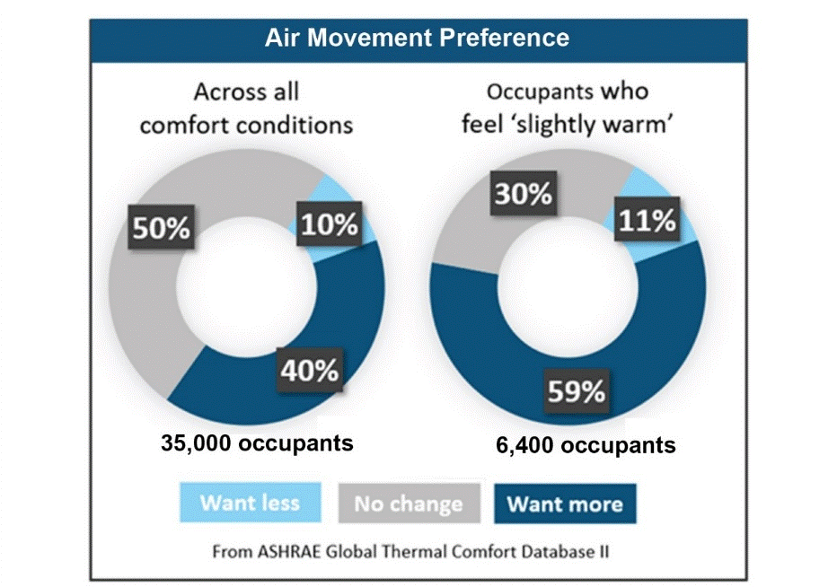

# Benefits of elevated air speed

Fans are more than just a basic amenity for residential applications. Increasingly, fans are found in applications varying from industrial to commercial buildings, from semi-outdoor spaces and high-end hospitality settings, and everything in between. The extensive use of fans in residential applications (over 80% of single-family homes in the United States have at least one ceiling fan), as demonstrated in Figure 1 below, indicates their effectiveness in supporting thermal comfort, and occupant demand for controllable air movement.

.png>)

This widespread applicability stems from the many benefits that fans can provide in interior environments. The key benefits of fans include thermal comfort, improved air distribution, improved air quality, energy savings, and first and operating cost reductions.

### Thermal comfort 

Simply stated, thermal comfort is an occupant’s satisfaction (“comfort”) with the thermal environment. For centuries, humans have been using air movement to help regulate thermal comfort. In warm conditions there is generally less heat loss from the skin than in cooler conditions, so people are at risk of warming up as our body needs to continually lose the heat produced in the body core. Increased air movement across the skin carries away more heat from the body via two physical processes, convection, and evaporation, thereby restoring comfort. Since the advent of mechanical air-conditioning systems, building designers have largely focused on air temperature and humidity. However, modifying other factors of thermal comfort, such as air speed, changes how the air temperature is perceived. Occupants near a fan feel cooler than they would feel at the same temperature and humidity in still air, like the phenomenon of “wind chill”. Therefore, when the air temperature is warmer, occupants near a fan will be more comfortable than they would be in still air conditions. In addition, large-scale studies of occupant survey data indicate that occupants would prefer more air movement than they have, especially if they report feeling warm, as illustrated in Figure 2. These studies also show that increasing air speed can increase satisfaction under all comfort conditions, as Figure 2 shows in these cases, 40% of occupants also prefer more air movement.

### Improved air distribution 

In addition to the thermal comfort benefits, increasing air speed by using fans in concert with the HVAC system can also improve air distribution and provide the desired thermal conditions more consistently throughout a space. When correctly designed and operated, fans support the HVAC system to minimize temperature gradients within a space, providing more consistent temperature and air quality conditions throughout a space. This improved air distribution can be effective for both heating and cooling scenarios. For example, ASHRAE Standard 62.1 – Ventilation for Acceptable Indoor Air Quality lists a ventilation effectiveness of 0.8 for ceiling-supplied warm air systems (due to stratification of the warm air near the ceiling) but adding ceiling fans in this scenario brings the ventilation effectiveness back to 1.0, or fully mixed condition, reducing the amount of outside air required. As described in “HVAC systems that are not favourable for ceiling fans”, fans do not work with HVAC systems based on stratification as displacement ventilation and underfloor air distribution.

### Improved indoor air quality 

By increasing air movement and improving air distribution in a space, fans can also improve air quality. It changes the airflow pattern in the space which can reduce an occupant’s exposure to indoor pollutants in several ways. In spaces with stagnant air or short circuiting, sources of air pollutants accumulate in the room locally. Air movement redistributes the air, diluting the concentration of these local sources of pollutants in the room air. A study has demonstrated measurable air quality improvement from ceiling fans and desk fans by dissipating carbon dioxide (CO2) and other exhaled pollutants that would otherwise gather near occupants in still air conditions ([Benabed et al., 2020](https://doi.org/10.1016/j.buildenv.2020.106655)). Another study shows that using the ceiling fan reduced the concentration at the exposed person’s breathing zone by more than 20% (Ref) (CHECK LINK). Effectiveness of upper-room ultraviolet germicidal irradiation system (UVGI) typically rely on natural convection of air within the space to disinfect microorganisms brought from the breathing zone up to the irradiated zones near the ceiling. Using ceiling fans greatly improved UVGI effectiveness by mixing the microorganisms-laden air up to the irradiation zone thus disinfecting them at a higher rate compared to case without using ceiling fans. Elevated air movement increases the deposition rate of airborne particles onto indoor surfaces such as fan blades and room furniture, floor, ceiling and walls, thus reducing the likelihood of occupants to inhale them. Increased air movement also prevents the sensation of stale or stuffy air and helps dissipate odors.

### Energy savings 

Perhaps most importantly, when implemented effectively as an integral component of a building’s thermal comfort strategy, fans can also result in significant energy savings by reducing the demand on the HVAC system. Although they consume energy, the potential HVAC savings outweighs fan energy use, typically by a factor ranging between 10 and 100 times. The primary energy saving derives from thermal comfort benefits, keeping occupants comfortable at higher temperatures, and allowing for increased cooling setpoints. In cooling, a room with fans is thermally comfortable over a wider range of temperatures than a room without fans. This wider range of temperatures reduces the cooling and AHU fan energy. Lastly, when ceiling fans are used to provide air distribution, reducing the extent of distribution ductwork and diffusers, they also help reduce HVAC fan energy by reducing the pressure drop in the air system.

### Cost savings 

Using ceiling fans to distribute air more effectively throughout a space can reduce the extent of distribution ductwork and diffusers required to serve a zone. Additionally, if the same zone is designed to a slightly higher cooling setpoint due to the comfort cooling effect provided by the fans, this can reduce the required latent and sensible cooling capacity of the HVAC system, providing first cost savings to chiller, air handling unit, and ductwork. The cost of fans is low when compared with the savings generated by the reduction of ducts and HVAC capacity. Moreover, as fans can help reduce energy consumption, they will consequently reduce energy costs.
