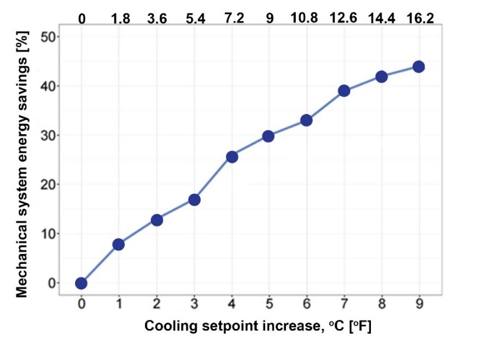

# System design comparison: conventional AC vs ceiling fan integrated AC

## Design layout and components 

This section discusses the difference in design and components needed between the conventional HVAC and ceiling fan integrated HVAC system using the same building layout plan (see Figure 54). In conventional HVAC system (see Figure 54a), diffusers are the prime fitting to distribute cool air over the space. They should be evenly installed and require detailed commissioning in balancing the air pressure over the supply air duct (i.e., maintain standard flowrate in each diffuser) to ensure air distribution effectiveness. Depending on the system requirements, variable air volume (VAV) boxes are installed for better zone temperature control.

Alternatively, shown in Figure 54b, the ceiling fan integrated air-conditioning design for the same layout requires only the main supply air duct throwing cool air directly from the sidewall towards the center of space. The ceiling fans can effectively mix the air and temperature within the space, without any diffusers nor extensive supply air ducts for uniform air distribution. The number of ceiling fan and corresponding installation location can be estimated using the [CBE Ceiling Fan Design Tool](https://centerforthebuiltenvironment.github.io/fan-tool/).

.png>)

Figure 54. Example design layout for (a) conventional HVAC system with supply air ducts and diffusers, (b) Ceiling fan integrated HVAC system with limited air ducts.

## System design, selection, and operation 

One major advantage for air movement design is the additional convection effects on occupants and zone equipment, meaning that additional energy saving from space cooling is possible due to HVAC system optimization.

### Design room conditions 

The presence of space air movement allows higher dry bulb room temperature (2-3 °C \[4-5 °F]) and dewpoint temperature (1-2 °C \[2-4 °F) when compared with conventional HVAC design. Alternatively, if the original designated air temperature is 23-25 °C \[73-77 °F], it can be increased to 23-27 °C \[73-81 °F] with elevated air movement to achieve similar or even better thermal comfort. The room’s operating air speed can be up to 0.8 m/s \[160 fpm] without personal control, while there is no air speed limit if occupants have full control of the fans (i.e., just ceiling fan or ceiling fan + desk fan) within the space.

### Systems selection 

Regarding the relaxation of designated cooling demand (i.e., lower sensible and latent load), the chiller and the air handling unit (AHU) from original HVAC system can be downsized in the system design stage. The design supply air temperature setpoint (SAT) and chilled water temperature (ChWT) setpoint relaxation should be 50% to 100% the zone cooling setpoint temperature adjustment. For example, if compared to a conventional HVAC design, the HVAC design with elevated air speed could have 2 °C higher cooling setpoint temperature, the SAT and ChWT setpoints should be increased by 1-2 °C. In addition, a smaller size fan in the AHU can be used for the ceiling fan integrated design, because it returns smaller static pressure along the critical supply air path (only require the main supply air duct).

## Potential savings 

### Construction cost 

Estimation from a consultant firm suggests that the ceiling fan integrated air-conditioning system in Figure 54 could save up to 45 % in capital construction cost when compared with the conventional HVAC system design. These savings are mainly obtained from reduced ductwork, diffusers, VAV boxes, sensors and controls. Savings can also be obtained from the extra time and workmanship for additional ducting and fittings installation. More importantly, the majority of these ducting and fittings are not reusable and become construction waste when the building is being demolished. The cost of purchasing and installing the ceiling fans in the space was very low when compared to the above cost savings.

### Energy consumption 

Substantial energy for space cooling can be accrued when implementing the elevated air movement with higher temperature cooling strategy. An energy simulation model of a standard office, in Figure 55, shows approximately 17 % of energy saving in the HVAC system by increasing the cooling temperature setpoint from 22 °C \[72 °F] to 25 °C \[77 °F]. In such room temperature setpoint adjustment, higher chilled water supply temperature (10 °C \[50 °F]) can be used, instead of the conventional temperature setpoint (7 °C \[44.6 °F]), which it would account for approximately 12% of additional energy saving from the chiller. Meanwhile, the consumption of cooling energy savings by increased room temperature setpoint tends to be much greater than the ceiling fans energy consumption. A study of 100 automated ceiling fan showed 36% of compressors energy savings when compared with air-conditioning only conditions, while the fans consumed only 2% of the total compressors consumption ([Miller et al., 2021](https://doi.org/10.1016/j.enbuild.2021.111319)).

Figure 55. Percentage of mechanical system energy savings by increased cooling temperature setpoints [(Duarte et al. 2017](https://escholarship.org/uc/item/7k1796zv)). The baseline temperature is at 22 °C \[71.6 °F], either reflecting cooling setpoint increase at 0 °C \[0 °F] in the x-axis.

## Continue testing and adjustment 

Conventional air-conditioning design requires detailed testing and commissioning on the airflow through the diffusers and the air pressure drop within the supply air duct. However, there is no standard procedures available for system testing for ceiling fans integrated system. Two recommendations are proposed to test the system’s effectiveness in the post-occupancy stage. First, conduct physical measurement on indoor temperature, mean radiant temperature, relative humidity, and air speed at the occupied zone, and check the zone comfort range using the [CBE Thermal Comfort Tool](https://comfort.cbe.berkeley.edu/). The post-occupancy air speed and pattern could be different from that in the design stage because these parameters are sensitive to room furnishings (e.g., desk, partition, and shelf). Second, it is strongly recommended to conduct a post-occupancy evaluation to understand the actual feelings and needs of the occupants. It is the most direct way reflecting occupants’ satisfaction and to plan mitigating action for improvement. If there are areas where air movement from ceiling fans cannot be reached, providing occupants with personal fans (i.e., desk, pedestal, or tower fan) could be a solution.
