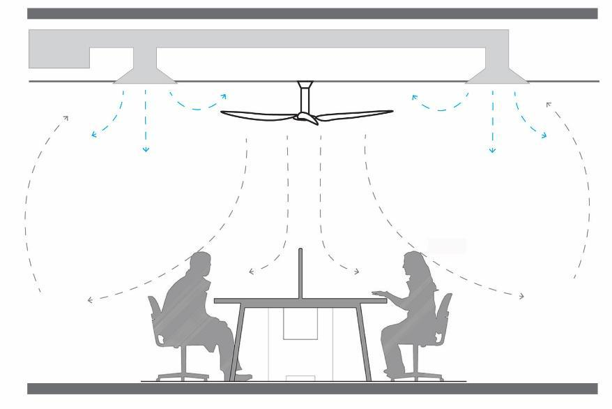

# Ceiling fan installation and integration with HVAC system

Ceiling fan requires the most attention regarding its design, installation, and operation when compared with the portable counterparts (e.g., desk fan, pedestal fan). On the other hand, it presents the biggest opportunities for integration with the HVAC system design and operation for cost and energy savings. Additionally, incorporating ceiling fans into the design for new construction projects can generate substantial net first cost savings. Therefore, this section discusses the installation requirements of ceiling fans in buildings and the design and operation approaches when integrating with the HVAC system.

## Ceiling fan system 

### Selecting fan sizes and determining the layout 

Determining appropriate fan size and layout is critical to effective cooling from ceiling fans. The highest air speeds - and therefore the greatest cooling effects - from a ceiling fan are felt directly beneath the fan blade tips and dissipate the farther an occupant is from the fan. For larger diameter fans, there is a substantial stagnation region directly under the fan center. Air movement and the associated cooling effect are also impacted by obstructions such as furniture, partitions, or equipment. Any permanent obstructions should be considered in determining fan layouts, but spaces that may change in layout over time should take this into account for any application.

Considerations should also include the overall design intent for the ceiling fan application, including the desired air speed uniformity, and overall coverage of the space. Spaces that are likely to benefit from more uniformity will require larger fans or more fans than the spaces that are likely to benefit from variability (see the Applications example from [<mark style="color:blue;">Table 4</mark>](prior-to-elevated-air-movement-design.md#\_design\_intents\_for)). Fan size and layout must also consider relevant code requirements (see [<mark style="color:blue;">Codes and Standards</mark>](codes-and-standards.md)), and potential conflicts and spacing requirements from other building systems such as fire sprinklers and lighting equipment.

To maximize uniformity of air speeds in a space with standard ceiling fans, choose the largest possible fan that fits in the space while maintaining appropriate mounting height and clearances from walls and other obstructions (see [<mark style="color:blue;">Fan mounting height and clearances</mark>](ceiling-fan-installation-and-integration-with-hvac-system.md#\_toc137734988)). For small and roughly square rooms such as residential spaces or private offices, where only one fan is required, a simple rule of thumb is that the fan diameter should be between 0.2 and 0.4 times the characteristic room width, as Figure 34 shows. For spaces with a single fan, as closely as possible given practical considerations, the fan should be centered in the room to maximize air speed uniformity. Generally, a single fan centered in a space can effectively serve a rectangular space with an aspect ratio (length : width) of up to 1.5 : 1. Rectangular spaces with higher aspect ratios, or other unconventional shapes, benefit from multiple fans to ensure relatively uniform air speeds throughout the space. For rectangular shape (and other unconventional shapes) room, the characteristic width of the room is the square root of the floor area. For example, in Figure 34, a 6 x 4 m \[20 x 13 ft] rectangular room, the characteristic width is 4.9 m \[16 ft] and using the simple rule of thumb above yields fan diameters between 1 to 2 m \[3.3 to 6.6 ft].

.png>)

For spaces requiring multiple fans the overall layout should be determined by subdividing the space into multiple equal roughly square “fan cells”, and then centering a ceiling fan in each cell. Fan cell size is determined largely by the overall dimensions of the space, and the preferred size of ceiling fans to be used. In many cases there may be a variety of options for fan cell and fan diameter. Fewer large fan cells will require larger diameter fans, while a larger number of smaller fan cells will require smaller diameter fans. When all fans operate at the same speed, the individual fan cells within larger spaces will behave much like smaller spaces with a single fan, and as such should target an aspect ratio of no more than 1.5:1. For Ratios above this value it is possible and beneficial to create split this cell into two fan smaller cells with smaller aspect ratios. As with smaller single-fan spaces, fan diameters should be at least in the range of 0.2 to 0.4 times the characteristic width of the fan cell. Higher values will increase the uniformity of air speeds throughout space. Fan-to-fan spacing should be determined based on centering the fan as much as possible within each fan cell and should take into consideration needs for air speed uniformity in the space. Spaces with high uniformity requirements may necessitate larger fans and closer fans spacing. Large spaces with high ceilings (at least 3.3 m \[11 ft]) should also be considered using large-diameter ceiling fans to maximize airflow and uniformity of air speeds (both horizontally, and vertically). Figure 35 presents two examples of recommended ceiling fan size and layout for multi-fan applications with the same site area (240 m² \[2580 ft²]) but different room heights and room functions: (a) warehouse and (b) office. In particular, Figure 35b demonstrates two layout settings: less fan cells with larger fans (on the left) and more fan cells with smaller fans (on the right). Despite the settings on the left, four fans with a diameter of 2.2 m \[7.2 ft], fulfil the rule of thrum mentioned above, large-diameter fans (i.e., >2.1m \[7 ft]) requires at least 3 m \[10 ft] safety mounting height above floor level. Therefore, these fans selection and arrangement are not suitable for office setup with 2.6 m \[9 ft] room height. The settings with smaller size but a greater number of fans on the right are more suitable in this situation.

.png>)

The [CBE Ceiling Fan Design Tool](https://centerforthebuiltenvironment.github.io/fan-tool/) automatically suggests fans dimensions and numbers based on the room dimensions, applying the describe considerations to determine an ideal layouts. Refer to section “CBE Ceiling Fan Design Tool” for more details.

### Fans installation 

Users are advised to install ceiling fans following the manufacturer’s recommendations. Nevertheless, they can be installed in all types of ceiling, and there is no reinforcement requirement if the diameter of fan is smaller than 2.1 m \[7 ft]. To adjust the fan height, some products allow extending the length of the downrod. The ceiling fans should be fixed in a structural surface of the building to guarantee sturdiness and stability, which can be a slab or beam. For suspended ceiling, the downrod should be longer to ensure sufficient blade-to-suspended-ceiling-height. A canopy shall be positioned below the suspended ceiling to improve aesthetics (see Figure 36a). With the appropriate type of mounting bracket, ceiling fans can also be installed in sloped ceiling (see Figure 36b).

.png>)

### Fan mounting height and clearances 

Another key consideration for ceiling fan effectiveness is mounting height and clearances. Mounting heights and clearances from walls and other obstructions are determined based on both safety and performance considerations.

Standard ceiling fans must be mounted at least 2.1 m \[7 ft] above the floor to prevent any accidental contact with blades (see Figure 37). In addition, industry standards recommend fan blades be at least 20 cm \[8 in] below the ceiling, though clearances of 31 cm \[12 in] or more are more optimal at providing air circulation into the swept area of the blades and avoiding ‘starving’ the fan. The distance between blades and the ceiling at which ‘starvation’ occurs increases with fan diameter. An approximation for this has the distance between the blade and the ceiling should be at least 0.2 times the fan diameter. For spaces with relatively low ceilings, “hugger” ceiling fans are available without downrods to maintain adequate clearance, though these fans typically have poorer energy performance than standard fans mounted at an appropriate distance from the ceiling. In spaces with higher ceilings, standard ceiling fans should be suspended on downrods at 3 – 8 m \[10 – 26 ft] above the floor to adequately cool occupants. In addition, standard ceiling fans must be located so that the sweep of the blades is at least 45 cm \[18 in] from any vertical obstructions such as walls or columns, though clearances of 0.6 – 0.9 m \[2 – 3 ft] are often recommended to enable proper air circulation.

.png>)

Safety regulations require almost all large-diameter fans (above 2.1m \[7 ft] in diameter) to be mounted such that the blades are at least 3m \[10 ft] above the floor (see Figure 38). A small number of large-diameter ceiling fan models can be mounted below 3m \[10 ft], but these fan models have limited rotational speeds to comply with safety regulations, and as such provide limited maximum airflows. As mentioned above, large-diameter ceiling fans typically require a minimum distance from the ceiling of 0.2 times the fan diameter, though manufacturer recommendations may vary. Similarly, large diameter fans typically require at least 1 m \[3 ft] of clearance from any obstructions to the sides or below the fan blades for safety and the ensure proper airflow around the fan blades.

.png>)

In addition to distances from ceilings, floors, and walls, fan placement must also consider any other obstructions in a space, including lighting, mechanical equipment and ducts, fire sprinkler systems, warehouse storage racks, as well as any relevant code requirements (see Codes and Standards section below). For example, when planning an installation of large-diameter ceiling fans in a warehouse, fans should be mounted at least 1m \[3 ft] above the highest level of any storage racks, stored items, and the tallest extent of any other equipment that may be used in the space such as forklifts. Fan placement and mounting height should also take into consideration any potential furniture placements, even though they may not be permanent. Cabinets or tall bookcases may interfere with fan operation, or cause safety hazards if located too close to ceiling fans.

### Multiple ceiling fans operation 

We learn in previous sections that the zone air speed and flow pattern from a ceiling fan can be determined by its fan size and rotational speed. However, in many circumstances, ceiling fan does not work individually but include multiple fans serving the same zone (e.g., open plan office). How does the zone air speed and flow pattern change with multiple fans interaction?

Detailed measurement of air speed induced by ceiling fans has been conducted in climatic chamber ([Liu et al., 2018](https://doi.org/10.1016/j.buildenv.2018.06.037)). It showed the speed difference and the distance between two ceiling fans will affect the airflow profiles within space. Figure 39 demonstrates the air circulation patterns interacting between two ceiling fans at both side view and top view for the conditions of (i) comparable air speed vs dominant air speed and (ii) fans set closer to each other vs further apart. The fans distances represented in Figure 39 are not recommended for design but aim at showing airflow pattern interaction with multiple fans.

If both fans are installed close to each other (i.e., 1.3 x D, center-to-center distance) and operated at medium or high speed, both air jets will skew towards each other, creating a high turbulence zone in the mid-layer between the fans. For the same close fan distance, if one fan is operating at a much higher speed than the others, the air circulation will be dominated by the stronger fan, while the weaker fan’s jet will be skewed towards the stronger one. A low air speed zone will be observed directly under the weaker fan, since the stronger fan has dominated the airflow (i.e., dragging air from the weaker fan and guiding the airflow along the floor level). For the same fan speed testing conditions but with two fans installed further apart (> 1.7 x D, center-to-center distance), the influence of airflow pattern by the other fan will be smaller, meaning that the air jet mainly follows the principle as a single fan condition. In other words, the airflow effectiveness by each fan has been maximized when compared with close fan installation case. From these experiments, the ceiling fans separation distance and their operation speed would impact a lot on the airflow pattern in space. These parameters must be verified early in the building design stage to maximize the system efficiency. Visualization tools that demonstrate the measured air speed and flow patten for a single ceiling fan and double ceiling fans operation at different distance and fan speed are available below:

single-fan case: [https://cbe-berkeley.shinyapps.io/single-fan](https://cbe-berkeley.shinyapps.io/single-fan)

double-fan case: [https://cbe-berkeley.shinyapps.io/two-fans](https://cbe-berkeley.shinyapps.io/two-fans)

.png>)

### Impact of infiltration rate 

The outdoor flow rate, sometime measured in air changes per hour (ACH), is one important parameter that determine the indoor environment quality and building energy consumption through mass and energy exchanges between indoors and outdoors ([Nazaroff, 2021](https://doi.org/10.1111/ina.12785)). Figure 40 illustrates the outdoor air exchange dynamics instigated by a ceiling fan through two distinct opening configurations, namely, the normal window opening and the door-like opening.

In the normal window opening condition, the induced airflow caused by the ceiling fan traverses upwards along the sidewall. A fraction of the upward flows will be dragged out of the window while the remaining that is retained indoors will form a closed-loop circulation back to the ceiling fan. In such a case, little impact of the room ACH will be independently initiated by the ceiling fan. However, the ACH will be dependent on the outdoor wind direction with respect to the window facing. When the window is facing the leeward side of the building, the ACH will be relatively low and thus operating ceiling fan would increase the air-exchange rate. Conversely, if the window is on windward side, the use of ceiling fan could reduce the ventilation rate when compared with no fan condition.

The adoption of a door-like opening configuration is indicative of an enhanced ventilation rate during the operation of a ceiling fan. The momentum of the stimulated airflow generated by the fan results in an outward displacement of air in close proximity to the floor. Meanwhile, negative pressure gradients developed at the apex of the door promote the inward influx of outdoor air, effectively enhancing air circulation. The degree of improvement in air exchange, expressed as the air changes per hour (ACH), is largely dependent to the performance capacity of the ceiling fan, specifically, its air flow rate and rotational speed.

.png>)

### Ceiling fan interaction with lighting 

While many ceiling fans are available with built-in lighting (i.e., light kits), typical ceiling fan lights may be insufficient for many lighting requirements and applications. Most applications will be best served by an independent lighting system with additional ceiling fan(s) installed alongside recess lighting that occupies the same ceiling space.

When the ceiling fan blade interacts with light distributed from a recess fixture (see Figure 41a), light flashing on surfaces (i.e., strobing) and at the light source itself (i.e., flicker) can occur. Some design recommendations have been proposed to overcome these problems, but these do not always resolve problems that are caused by the application of ceiling fans. To remove flicker, it is often suggested to move the ceiling fan away from recess lights (see Figure 41b). While this recommendation will likely prevent strobing, it does not stop flicker ([Kent et al., 2020](https://doi.org/10.1016/j.buildenv.2020.107060)).

The visual line of sight from the occupant to a recess fixture can still be blocked by a ceiling fan since the ceiling fan blades are mounted below the electric light (see Figure 41b). Therefore, this design arrangement between the ceiling fan and recess lighting still creates flicker seen from multiple viewing positions inside the space. Another design option is to use dropdown lighting (i.e., light fixtures are suspended at the level of fan blades or below them, see Figure 41c), which bypasses issues of flicker completely, and prevents strobing on the floor surface. However, drawbacks to this configuration may occur in low floor-to-ceiling applications when reflections from adjacent surfaces are projected back onto the ceiling or onto wall surfaces, creating strobing. Meanwhile, glare from electric lights may also be produced when they are mounted closer to the occupants’ head.

.png>)

Strobing and flicker can also occur when ceiling fans interact with daylight transmitted through skylights (see Figure 42). These problems will naturally arise when direct sunlight is admitted into the space, increasing both the temperature and the need to use ceiling fans. Unlike recessed lighting, maneuvering the ceiling fan may not remove strobing when the roof is fully glazed by the skylight. The size and number of blades are often larger to increase the effects of space cooling in these applications. This generally increases the area and frequency in which strobing, and flicker may occur inside the space.

.jpeg>)

There are many adverse effects that are caused by visual flicker. Increased visual discomfort was an overt consequence from a design layout that followed current recommendations in a recent [study](https://escholarship.org/content/qt3wj1f6xj/qt3wj1f6xj.pdf). Short-term exposure (i.e., about 10-minutes) to flicker from the configuration, shown in Figure 43, made it hard for people to concentrate, which lowered their mental performance [Kent et al., 2020](https://doi.org/10.1016/j.buildenv.2020.107060)). This could hinder learning in schools or reduce productivity in offices. Under a longer exposure time, like daily working conditions, and for populations highly sensitive to flicker (e.g., photosensitive people), the effects of flicker caused from ceiling fans may be exacerbated.

.png>)

Not all buildings that use ceiling fans and recess lighting together will produce flicker. This mainly concerns smaller spaces, where the risk of the two technologies interacting with each other is higher. Designers should distribute ceiling fans and electric lights to achieve the desired air-movement and illuminance level while avoiding issues that lead to visual or thermal discomfort. When there are risks of strobing and flicker caused by ceiling fans, some alternatives solutions can be suggested.

Transparent ceiling fan blades: This allows light to be transmitted through the blade material, avoiding flickering even when the ceiling fan position would obstruct the electrical light. Nevertheless, it poses additional safety concerns when compared to opaque blade fans, especially for low floor-to-ceiling height applications.

Bladeless ceiling fan: Fan blades are covered by a casing material that prevents them from interacting with electrical lights.

Other fan types: Fans not mounted onto the ceiling pose no risk to the lighting design of the building.

Diffuser panel (skylight applications only): Diffusing the daylight entering though the skylight may alleviate, or even completely remove strobing and flicker from occurring.

## Air-conditioning system 

The intent of this section is to discuss some common HVAC system that integrates with ceiling fan. The discussion will be focused on how ceiling fan integrates with the system, instead of how to design the HVAC system itself, which is addressed in the [Integrated ceiling fan and HVAC control](ceiling-fan-installation-and-integration-with-hvac-system.md#\_ref127806888) section&#x20;

### Conventional HVAC system with diffusers 

Ceiling fans can be directly implemented to existing air-conditioned buildings with installed ceiling diffusers, as long as that the requirements of mounting height and clearance are fulfilled as described in previous section (see Figure 44). The benefits of installing ceiling fans, i.e., increase building efficiency, improve thermal comfort, and enhance air speed and temperature uniformity, can be achieved. For the air-conditioned space that has shorter floor to (false-) ceiling height, the use of other air movement devices is encouraged due to safety consideration.

### Side-wall supply jet 

The function of diffusers and branch ducting in conventional HVAC system is to distribute conditioned air evenly through indoor space, especially for the areas that are away from the main supply air duct. The same purpose, however, can be achieved by operating ceiling fans, meaning that the diffusers and branch ducting could be reduced or completely removed.

.jpeg>)

Figure 45 demonstrates a new approach on how HVAC system integrates with ceiling fans. The cool air is supplied from a high-sidewall vent directly towards the center of the space. Then the ceiling fan mixes the supplied cool air with the room air and distributes it over the indoor space. The immediate benefit of such HVAC – ceiling fans integrated system is the reduction of unnecessary duct work on the ceiling, thereby saving significant amount of costs on the initial construction and continuous maintenance. Further discussion on cost saving with a case study will be demonstrated in the later section of this guide. Secondly, without a false ceiling and extra ducting on top, the ceiling fan is operated more safely and effectively due to maximized mounting height and sufficient clearances between the ceiling and fan blades, especially for a space with limited floor to ceiling distance.

In such a system, the cool supply air would best be fed through the fan (i.e., above the ceiling fan blade), rather than impinged into downward airflow initiated by the ceiling fan (i.e., below or level to the ceiling fan blade). Although the air velocity distribution pattern will be dominated by the ceiling fan airflow in both cool air supply conditions, the air temperature profiles delivered to the occupied zoom is different. Figure 46 shows the cool supply air merged with the ceiling fan downward airflow, which possibly initiating a cold draft into the occupied zone, when the cold air is supplied at fan blade height ([Chen et al., 2020](https://doi.org/10.1016/j.buildenv.2020.106660)). In contrast, if cool air is supplied above the fan blade, the supply air is immediately mixed with the room air, it provides a uniform air temperature into the occupied zone.

This approach has been studied for cooling conditions. In heating, the fan may be used in reverse mode but there is no available knowledge about its performance, therefore caution should be used.

.png>)

### Radiant heating and cooling 

Radiant heating and cooling systems can achieve significant energy savings, peak demand reduction, load shifting, and some thermal comfort improvement compared to conventional all-air systems. The pipes can be either embedded into to the slab (ceiling or floor) or installed inside a radiant panel. Ceiling fans are a good match with radiant heating and cooling systems as they can also increase heat transfer from the radiant system (requiring lower temperature differences between the room and the water, further improving efficiency), and provide the occupant with a means of instantly changing the comfort condition in the space. Figure 47 shows the integration of ceiling fan with radiant system with water pipe embedded into the slab and inside the radiant panel.

.png>)

In terms of system efficiency, compared with a conventional radiant ceiling cooling system (without ceiling fan), the cooling capacity of a radiant system with ceiling fan can be increased by up to 22 % and 12 %, respectively, when the fan is blowing upward and downward ([Karmann et al., 2017](https://doi.org/10.1016/j.enbuild.2017.10.046)). Upward blowing fan moves the air directly towards the radiant cooling panel on the ceiling, thus resulting in higher cooling capacity. Likewise, a downward blowing ceiling fan, with higher air speeds along the floor, would maximize the cooling capacity of a radiant floor system. Another study on radiant floor systems found that downward blowing ceiling fans increased the radiant slab cooling capacity by 16 % at 24 °C \[75 °F] operation temperature and increased by 26 % at 26 °C \[79 °F] temperature ([Pantelic et al., 2018](https://doi.org/10.1016/j.enbuild.2018.03.002)). Experimental results suggest that elevated air speed in space enhances cooling capacity and system efficiency in radiant system by improving the convective heat transfer.

#### HVAC systems that are not favorable for ceiling fans 

While we have introduced above the HVAC systems that are favorable integrating with ceiling fans, there are also some HVAC designs unfavorable for ceiling fan operation. These systems mainly aim at temperature and pollutant stratification instead of air mixing, such as displacement ventilation and underfloor air distribution system.

Figure 48 presents the airflow patterns of a typical displacement ventilation system. The conditioned cool air is supplied from an air handling unit through diffusers, either located against a wall or at the corner of a room. The cold air gets warmer by absorbing heat from the heat sources (e.g., occupants, equipment) and slowly rises to the top. Thermal plumes are formed due to the density difference between the cold and warm air. Finally, the warm air on the ceiling is removed by the return air outlet. One benefit of displacement ventilation is the improvement of air quality by removing fine particles in the room (light particle goes together with the thermal plumes and exhausts out). The presence of ceiling fan, in this case, will adversely mix the air and temperature inside the room causing the thermal plume dependent on the temperature gradient to no longer exist.

.jpeg>)

Similarly, the airflow pattern in the underfloor air distribution (UFAD) system (see Figure 49) also relies on the temperature difference within the space, by providing fresh and cool air from underfloor to the lower occupied zoom and exhausting the warm air in upper unoccupied zoon from the ceiling return. Again, the presence of ceiling fan in UFAD would break the ventilation path, resulting in negative system effectiveness.

.jpeg>)

## Integrated ceiling fan and HVAC control 

This section describes the control strategy for integrating ceiling fans and HVAC system.

### HVAC system control with / without a fan 

Figure 50 demonstrates the control schematic for the HVAC system with and without the integration of a ceiling fan. The HVAC signal for heating reduces when indoor temperature increases accordingly, and it stops when the indoor temperature goes beyond the heating setpoint say 21 °C \[70 °F]. For a case without ceiling fans, the HVAC signal for cooling starts when the indoor air temperature goes higher than the first cooling setpoint temperature say 24 °C \[75 °F]. Alternatively, for a case integrated with ceiling fan, the fan may respond to zone temperature, acting as the first stage of cooling for a zone before the HVAC system begins to operate in cooling mode. The ceiling fan will operate at the first cooling setpoint of 24 °C \[75 °F] to provide convective cooling and maintain occupants’ thermal comfort without operating the HVAC. The fan speed increases with zone air temperature until reaching 25.5-26.5 °C \[78-80 °F], at a point which the HVAC system begins to modulate and to maintain that setpoint, providing the second stage of cooling. Operating the HVAC system at this higher cooling setpoint has significant energy savings potential.

.jpeg>)

### Ceiling fan speed control 

Ceiling fans can be integrated with the building automation system (BAS) through several mechanisms. True integration requires speed control of the fans, and this is typically achieved using either a 0-10 V input or a BACnet interface. Using the same control case above, Figure 51 shows the control scheme for the ceiling fan speed when responding to zone temperature.

Within the dead band, especially when HVAC is in heating mode, the ceiling fan should be turned off or operated at lowest possible air speed (or even rotating in reverse for destratification or general air mixing). The fans will need to stay on if the HVAC system and its air distribution strategy was designed with less ducts and diffusers assuming the fans would have been in operation for air mixing. When the temperature reaches the fan cooling setpoint, e. g., 24 °C \[75 °F], a signal from BAS will operate the ceiling fans in the space to provide the first stage of cooling. The ceiling fan speed increases with the room temperature, which is determined by cooling effect or predicted at a representative point in space. HVAC for cooling operates when the room is at the HVAC cooling setpoint, e.g., 25.5-26.5 °C \[78-80 °F] and operates to maintain the room at that temperature. Ideally, the fan speed will increase with the room temperature till the maximum (i.e., 100 %). At all stages, the fan should be controllable by users, meaning that occupants can override fan speed and on/off status any time. The same applies for the HVAC cooling setpoint. However, there should be an automated system review (or regular manual review) of setpoints throughout the building to ensure they have not been adversely overridden by an occupant and left in place indefinitely.

<figure><figcaption>
Figure 51. Example ceiling fan control schematic.
</figcaption></figure>

### Ceiling fan control alternatives 

Some ceiling fans have onboard sensing and controls that allow fan speed and temperature automation without integration with the BAS. A lower cost, simpler alternative to automatically control the ceiling fan based on temperature is to use a relay to turn fan(s) on and off. The fans then operate at a fixed pre-set speed. This only provides on/off control, and as such can only be effective over a small range of temperatures without a ‘typical’ occupant in the space experiencing conditions that are either too warm (insufficient air movement) or too cool (excessive air movement). This approach is mostly applicable for:

* the use of ceiling fans predominantly to mix the air within the space and aim for relatively low air speeds (e.g., ≤ 0.25 m/s \[50 fpm]) in the occupied zone. Example applications include: destratification in heating, or air mixing to reduce the need for distribution ductwork.
* for spaces where variability in air speeds is beneficial (e.g., the occupants can easily move within the space, such as a lobby, event space, or hallway).

Fans operation can also be tied to occupancy sensors in the zone, preventing unnecessary operation, energy use, and maintenance. In some cases, it may be beneficial to operate fans even when unoccupied, such as pre-cooling applications that benefit from increased convection from surfaces in the space due to the air movement generated by the fans.

### Smart ceiling fan and HVAC control algorithm 

Apart from controlling the ceiling fans based on temperature setpoint, smart fan control can also be achieved based on occupant’s characteristics, such as occupancy and user preference feedback. To do this, all ceiling fans are connected and controlled by a central controller, as part of the smart building management system, to acquire environmental data such as temperature, relative humidity (RH), and occupancy from a network of sensors in the space. From those inputs, the control algorithm calculates in real-time the optimal fan speed to maximize thermal satisfaction for occupants ([Liu et al., 2018](https://doi.org/10.1080/23744731.2018.1452508)). The ceiling fan controller can also be integrated with the HVAC controller for cooperative operations by adjusting the zone temperature setpoints when necessary. There are two main control strategies, automatic mode that is based on ASHRAE 55 comfort model and cooperative mode, that is based on people feedback.

In automatic mode, the integrated PMV-SET (Predicted Mean Vote - Standard Effective Temperature model used in the ASHRAE 55 standard) is utilized to evaluate the thermal comfort in each zone in real-time to determine the optimal fan speed settings ([Liu et al., 2018](https://doi.org/10.1080/23744731.2018.1452508)). The model inputs include real-time temperature and RH from the environmental sensors. Personal parameters, i.e., metabolic rate and clothing, are pre-defined within the algorithm. The cooling effect due to elevated air movement is obtained by iteratively solving the SET equation. The output of the PMV-SET model is the desired air velocity to achieve the pre-set targeted PMV range, which is the comfortable range between -0.5 to 0.5. Figure 52 illustrates the PMV-SET with Occupancy control algorithm at automatic mode.

<figure><figcaption>
Figure 52. Automatic control mode of ceiling Fan using PMV-SET algorithm, environmental sensors, and occupancy sensors.
</figcaption></figure>

In cooperative mode, the ceiling system operates based on the environmental data and real time occupants' preference feedback, such as preference for cooler or warmer thermal sensation and preference for more or less air movement. Occupants would give their feedback anytime via a software application receiving individual users’ feedback regarding their preference on fan speed and/or thermal sensation. In this way, the user sensation preference becomes an active input component as a “human-sensor” in the closed-loop ceiling fan control system (see Figure 53). For example, if most of the occupants in the space (i.e., 80 % - adjustable by setting) prefer a cooler environment, first a higher fan speed will be set to satisfy the occupants’ needs; if this is still insufficient, then a lower indoor temperature setpoint could be set. This strategy has been successfully applied to a Zero Energy Building in Singapore achieving high energy savings (\~32%) and high thermal comfort <mark style="color:blue;background-color:red;">(ref) (CHECK LINK).</mark>

<figure><figcaption>
Figure 53. Ceiling Fan cooperative control mode using occupants' preference feedback.
</figcaption></figure>
