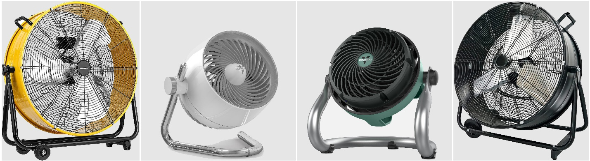

# Other air movement devices

While the benefits of elevated air movement by ceiling fan are acknowledged, places with lower floor-to-ceiling height or a ceiling with compacted fixtures could be limited for ceiling fan installation. This limitation can be mitigated by using other air movement devices.

## Fan Types 

Various air movement devices are available in the market, but there is no standard classification protocol to define them. Based on the function and location of usage, this guide discusses 5 major types of air movement devices: desk fan (bladed and bladeless), pedestal / tower fan, wall mounted fan, bladeless ceiling fan and air circulator.

### Desk fans 

The term ’desk fan’ generally describes a fan that is portable with a size small enough to place on the desk or table within reach of an occupant. It can be subdivided into bladed and bladeless fan. Desk fans with blades available in the market are generally with a diameter between 7 to 35 cm \[3 to 14 in], like the one shown in Figure 21a. Desk fans with diameter smaller than this range would also be beneficial when working at close distance to the user (< 0.5 m). Meanwhile a larger size fan would be too bulky to place on the desk. In addition, some desk fans are attached with a clip-on base, which allows users to clip the fan on the partition or the edge of their desk (see Figure 21b).

To ensure safety when the fan is in operation, the blades of a fan are enclosed inside a resistant plastic or metal mesh usually, some small fans with low power (<5 W) do not need encloser as the risks are minimized. Further enhance safety and an aesthetical outlook, we even have fans with no blades in the market. Figure 21c shows an example of bladeless fan. Although it looks and operates like “bladeless”, these fans have blades operating inside the fan body. The inner blades with motor draws air in at the bottom and push air up into the ring portion of the fan to create the air stream. The size of ring portion varies by fan product and are not necessarily circular in shape. In general, bladeless fans operate at a louder noise and require more energy in moving the same volume of air when compared to their axial counterparts.

### Pedestal fans / Tower fan 

Pedestal fans, also known as standing fans, are quite similar to desk fans, but with the fan head mounted to a height-adjustable pedestal, elevating the fan to about 0.6 to 1.2 m \[2-4 ft] from ground. The fan operates on a tall stand to enhance air circulation (avoid obstacles on the floor) in larger rooms, and its ability to oscillate left and right delivers air to a broader area. Figure 21d shows an example of a pedestal fan. Although pedestal fans are meant to be portable, they usually come with a heavy base to maintain stability when operation, which is less portable when compared to desk fans. This heavy base allows larger fan size operates on top, i.e., provide more airflow, with market available blade diameter ranges from 30 to 76 cm \[12 to 30 in]. The number of blades for a pedestal fan usually ranges from 3 to 5 blades, with some special models up to 9 blades.

Another common type of fan used on the floor is the tower fans. Unlike axial fans (draw and deliver air along the fan axis), a tower fan is a crossflow variety (draw and deliver air perpendicular to the impeller fan axis). A crossflow fan pulls air from the inlet into a cylindrical impeller vane, housed inside the tall and slim fan structure, by setting up a cylindrical vortex of spinning air. The vortex then swings the air to the opposite side of the impeller blades and pushes the air out alongside the rectification plate (i.e., the outlet duct). The enclosed impeller blade design maximizes safety for residential usage, especially with kids and pets around. The tower-like structure is fixed on a base and rotates horizontally to extend the air movement sweeping area. The tower fans are compact and lightweight, and fit well for any indoor spaces serving both personal cooling and air circulation purposes. The airflow produced by tower fan is usually laminar and uniform along the tower. Figure 21e shows an example of a tower fan.

.png>)

### Wall mounted fans 

A wall mounted fan is basically a pedestal fan without a base that is mounted on the wall. Sometimes these fans may also mount to the ceiling. Yet, different from conventional ceiling fans, these “ceiling mounted” fan can oscillate in 180 °. It is a good choice to provide a breeze over the human body and enhance room air circulation when the space and floor-to-ceiling height is limited. Figure 22 shows some examples of wall mounted fans.

.png>)

### Bladeless ceiling fan 

A bladeless ceiling fan operates as a centrifugal fan, differently from the conventional ceiling fan which uses an axial fan. In theory, bladeless ceiling fan is not bladeless, but a special design with many small blades installed at the fan’s circumference structure. The fan rotates the entire design structure, which draws air under the fan and hurls it out at the side from 360 °. These fans are intended to enhance air movement and air circulation within a small space, such as living room and bedroom. Figure 23 demonstrates some examples of bladeless ceiling fans. They are less common than other fan types. The installation requirement is similar to ceiling fan with blades, but the bladeless ceiling fans do not require a minimum mounting height to prevent “air choking”, which they are suitable to be installed in a space with low floor-to-ceiling height.

.jpeg>)

### Air circulator 

Air circulators aim to provide a high velocity air jet to circulate air and keep air moving continuously in the room. The strong air movement is not intended to directly be blown towards the human body, but to initiate air circulation. Depending on the brand, the air circulator diameter range is between 23-40 cm \[9-16 in]. Such fans are ideal for air circulation in small rooms, such as bedrooms and enclosed offices. An extra-large air circulator about 50 to 76 cm \[20-30 in] in diameter, also known as the drum blowers, with durable metal construction, can deliver extra high velocity airflow. These heavy-duty air circulators are ideal for warehouses, industrial workshops and loading docks. Figure 24 illustrates some examples of air circulators.

## Fan selection considerations 

### Typical functions 

The above-mentioned air movement devices basically have two major functions: (1) move air directly towards the human body and (2) room air circulation. Moving air towards the human body aims to cool the subject by means of convective heat loss, while air circulation aims to keep air in motion within the enclosed space to enhance air and temperature mixing. In general, smaller fan that generates less airflow (i.e., desk fan) is more suitable for direct cooling towards human body, while larger size fan and fan that generates stronger airflow (i.e., bladeless ceiling fan, air circulator) are designed for air circulation. Nevertheless, most of the fan types can deliver both functions by adjusting the fan speed. Therefore, fan selection should be based on the intent whether it is individual adjustment for personal cooling (group 1) or produce a general air movement effect for multiple occupants’ usage simultaneously. Table 2 summarizes the typical function, location of application, and approximate price range for different elevated air movement devices.

Table 2. Summary of other air movement device’s function, and approximate price range.

<table><thead><tr><th width="165">Fan Type</th><th>Typical function</th><th>Application location</th><th>Price range (USD)</th></tr></thead><tbody><tr><td>Desk fan</td><td>Air movement towards human body</td><td>Workstation, bedroom, study room</td><td>$ 10 - $ 300</td></tr><tr><td>Pedestal fan</td><td>Air movement towards human body / Room air circulation</td><td>Open plan office, residence</td><td>$ 40 - $ 400</td></tr><tr><td>Tower fan</td><td>Air movement towards human body / Room air circulation</td><td>Bedroom, personal office, small room</td><td>$ 40 - $ 450</td></tr><tr><td>Wall mounted fan</td><td>Air movement towards human body / Room air circulation</td><td>Residence, waiting room, restaurant, school, warehouse</td><td>$ 50 - $ 300</td></tr><tr><td>Bladeless ceiling fan</td><td>Room air circulation</td><td>Residence, office</td><td>$ 500 - $ 1000</td></tr><tr><td>Air circulator</td><td>Room air circulation</td><td>Warehouse, residence, open plan office</td><td>$ 50 - $ 300</td></tr><tr><td>Conventional ceiling fan (with blades)</td><td>Air movement towards human body / Room air circulation</td><td>Any indoor / semi-indoor space with sufficient mounting height</td><td>$ 200 - $ 1000</td></tr></tbody></table>

### Noise levels 

Noise from a fan can initiate dissatisfaction and unwillingness of usage from occupants. The noise sources of a fan are mainly from the operating motor and the fast movements of the blades (i.e., turbulence). The sound level of domestic fans ranges from 30 to 70 dBA depending on the fan types (e.g., desk, pedestal, ceiling), fan models and speed. Table 3 suggests the noise level for some corresponding features for comparison. The noise level from axial fan, initiated by turbulence, increases with the blades rotational speed. Therefore, higher speeds usually correspond to higher noise level. While for the cross-flow fan, the air output is generally laminar with lower air speed (i.e., lower blade rotational speed), thus the noise being generated is also relatively lower.

Nevertheless, the noise cannot be characterized only by sound level, its frequency distribution is also an important aspect. Low frequency noise is identified to be annoying in dwellings and this kind of noise is associated with appliances such as fans. Sometimes, a louder noise with uniform frequencies might be less annoying than a lower sound level but that peaks at specific frequencies. Furthermore, the fan design also plays an important part in the definition of a fan’s sound level and frequencies. Thus, it is not practical to conclude one fan type will always be quieter than another. Users are encouraged to experience the fan usage before purchasing.

Table 3. Noise level by comparison.

| 		                                | Sound level (dBA) | Corresponding feature                                        |
| --------------------------------- | :---------------: | ------------------------------------------------------------ |
| No health hazards                 |         10        | Mosquito buzzing, PC running                                 |
| No health hazards                 |         20        | Clock ticking, leaves rustling                               |
| No health hazards                 |         30        | Whispering, breathing sounds                                 |
| No health hazards                 |         35        | General indoor fan (depends on fan size, speed, and model)   |
| Concentrating becomes problematic |         40        | Street noise with double insulation                          |
| Concentrating becomes problematic |         50        | Refrigerator in 1m distance, gentle rain                     |
| Concentrating becomes problematic |         60        | Conversations, frogs croaking                                |
| Concentrating becomes problematic |         70        | Normal traffic                                               |
| Concentrating becomes problematic |         80        | Motor bike engine                                            |
|                                   |                   |  Over 80dBA health is threatened with exposure over 40h/week |

### Power and efficiency 

Most elevated air movement devices described above are powered by the electric grid. The electricity powers up the motor and spins the blades like the ceiling fan. Most of these air movement devices are not fixed in position, which can plug in any power socket outlet near the desired operation area. Some small fans can be powered by rechargeable lithium-ion batteries, meaning that the fan is cableless to enhance additional flexibility when operating. Some small desk fans with diameters between 7 -15 cm \[3-7 in] can be powered by a USB plug linked to a computer.

In general, efficiency is the ratio of the output to the input. For fans, the Cooling fan efficiency (CFE) index ([Schiavon & Melikov. 2008](https://www.tandfonline.com/doi/abs/10.1080/10789669.2009.10390882)) used to evaluate the cooling performance is defined as the ratio between the cooling effect of the device and its power consumption. The following equation represents the calculation of the CFE index, where$$P_f=$$ the input power of the fan (in W) and$$\Delta t_{eq}=$$ the whole-body cooling effect (in °C or °F).

$$
CFE = \frac{Cooling\
Effect}{Fan\ Power} =(-1) \frac{\Delta t_{eq}}{{P_f}}
$$

Due to different designs and usage, the performance of cooling fans (e.g., ceiling fan, desk fan, tower fan) with regards to their cooling effect and cooling efficiency can be varied. Figure 25 demonstrates the test results on some ceiling fans, desk fans, tower fans, and standing fans to depict their relationship between CFE and fan power. The desk fan tested in this study consumed the least power (16 – 20 W) and obtained the highest cooling fan efficiency (0.095-0.177 °C/W \[0.17-0.31 °F/W]). The results are interpreted upon normal condition usage of fans, meaning that the desk fan is smaller in size (i.e., smaller motor) and the fan operation distance is closer to human subject (maximize cooling effect) when compared with other fan types. Indeed, desk fans are designed to provide local cooling by generating airflow towards the human body instead of circulating air for the entire space (like the other fans do). Eventually, the intent of fan usage (local cooling vs air circulation) should have been taken into consideration when quantifying the fan effectiveness. While the efficiency of the fan itself is somewhat important, any fan’s electricity consumption (even not the most efficient type) is always relatively low when compared to using just air-conditioning to provide thermally comfortable conditions to humans. More details are discussed in the section “Potential savings” in this guide.

.png>)

### Motor and drive 

All the elevated air movement devices described above, with or without blades, consist of a rotary part, which is driven by motor and drive. The types of motor and drive used for these elevated air movement devices are similar to that operate in a ceiling fan, which we have been discussed in the former section. It is worth noting that larger energy saving potential can be achieved by using DC motor instead of AC motor, especially for small fans like desk fan or pedestal fan.

### Air Speed / Airflow pattern 

Performance of air speed from different devices can be varied by fan size, blade types, and fan structure. For axial fans, estimation of air speed is similar to ceiling fan (i.e., dividing the rated airflow of the fan by its diameter). However, such estimation is not applied to bladeless fans and tower fans which have a different airflow driven mechanism.

There is no existing requirement or standard on typical air speed for the air movement devices described above. Air speed and airflow requirement is more critical to the application than place of usage. We will discuss the air speed and airflow requirements based on the usage of (i) direct cooling towards human body, and (ii) room air circulation.

Direct cooling towards human body: When choosing an air movement device, customers tend to select a stronger fan which can produce more airflow and faster air speed. While it is true that bigger and stronger fans can provide better cooling effect, the question is do we really need that much air movement if the fan is intended to operate close to us? The fact is, sometimes we may experience too strong air movement from a nearby fan blowing toward our body, even though it is working at the lowest available fan speed. Figure 26a shows the environment is thermally comfortable if the surrounding air speed is 0.5 m/s \[98 fpm]. A cooling effect of 2.8 °C \[5 °F] means that, with current thermal condition, the subject is actually feeling 2.8 °C \[5 °F] lower than the actual temperature (equivalent to 23.2 °C \[73.8 °F]). If the fan is placed closer to the occupant, or the air speed is increased to 0.8 m/s \[157 fpm]. Keeping other thermal parameters unchanged, Figure 26b suggests a cooling effect of 3.5 °C \[6.3 °F], where the occupant became slightly cool and outside the thermal comfort zone. This example demonstrates that choosing a fan with possible lower airflow turndown (minimum speed divided by maximum speed) capability could be the key for better comfort in terms of direct convective cooling. Figure 27 illustrates the airflow examples for desk fan, pedestal fan, tower fan, and wall mounted. The oscillating function of these fans helps to deliver air movement at a wider coverage range and to minimize the risk of unwanted draft from long term spot cooling.

.png>)

.png>)

Room air circulation: An air movement device that aims to circulate the air within a room is either bigger in size (i.e., ceiling fan, bladeless ceiling fan) or able to generate high airflow jet with high speed (i.e., air circulator) to drive the air movement.

The airflow pattern of bladeless ceiling fan is quite similar to a reversely operated ceiling fan, but it applies the centrifugal technique to draw the air from the bottom to the center of the fan then throw it out perpendicularly at the side from 360°. Figure 28 shows a schematic on how air is driven by a bladeless ceiling fan. The goals for such air movement strategy are (i) to elevate the average air speed in the occupied zoon and (ii) to mix the air in the space minimizing stratification. It is worth noting that this system works best with close loop airflow within a small to medium size enclosed room (e.g., enclosed office, residential). Since there is no direct air jet blowing towards the occupants, the air speed in occupied zone will be too low if there is no air reflected from surrounding walls. To minimize this problem, some bladeless ceiling fans have modified the fan body design, which is able to guide the airflow slightly downward (i.e., less than 90° flow) towards the occupied zone.

.jpeg>)

An air circulator intends to produce a high-speed strong air jet to move air from one side of the room to the other. Figure 29 presents a schematic representation of the airflow pattern for an air circulator in an enclosed room. Similarly, this strategy aims to move the air to increase the average air speed and to enhance air mixing in space. Thus, the air circulation effectiveness also works better in small to medium size rooms. Different from the bladeless ceiling fan approach, however, air jet from the air circulator is freely adjustable within the occupied zone. Basically, the air circulator can reduce the fan speed, temporally act as a desk fan, or pedestal fan blowing air directly towards human body for immediate cooling. In addition, to enhance long distance air movement, some air circulator’s fan blades are modified to a propeller (or turbine) type. Instead of moving air parallel to the fan axial, it drives the air in form of a vortex which propagates along the fan axial. This feature helps to centralize the airflow across longer distance and to drag surrounding air towards the propagation of air stream to maximize the airflow rate. The air movement distance from an air circulator is much longer when compared with normal desk or pedestal fan with a flat blade.

.png>)

### Flexibility 

One major advantage of the above listed elevated air movement devices over ceiling fan is the high flexibility of usage in terms of location, operation height, flow direction and oscillation. Such flexibility enhances adjustment to occupant’s needs and comfort demand regarding elevated air speed under different circumstances. Except the wall mounted fans and bladeless ceiling fans, all other fan types listed in Table 2 are flexible to be relocated based on the occupant’s needs: on the desk or floor, directed to or away from the occupants, and any places that can move air to the desire direction. Fan operation height of pedestal fans are adjustable, usually about 0.6-1.2 m \[2-4 ft] from ground (depending on brand and type), while some other fan types, such as desk fan and air circulator, can adjust the air stream shooting height by tilting the fan head at certain vertical angles.

Most of the fan types listed in Table 2 can oscillate horizontally in a range of 60 ° to 160 °. Some modern fan types can also oscillate vertically. Horizontal or vertical oscillation of fan allows the air movement to cover wider area within the space and to serve multiple occupants at the same time. In addition, the fan oscillation function could minimize the stale air areas by moving the air from different directions, even behind some obstacles such as furniture or partitions, which enhances effectiveness of air mixing. It is one of the major benefits of ceiling fans usage in space. Portable fans can be operated in different rooms in the same space (i.e., one fan serves multiple rooms).

### Other features 

Some fans are equipped with technologies that enable them with special features. Some tower fans and bladeless fans are equipped with multiple filters, contributing to air purification. Particulate matter and sometimes gases in the air can be filtered out and cleaner air will be circulated within the space. Different types of filters can remove various kinds of contaminant. Some special fan models are installed with UV-C (i.e., germicidal UV) light inside the fan framework to disinfect the air during circulation process. UV-C is effective at deactivating viruses, bacteria, mold, and fungus. Some fan models can emit water mist that moves along with the air stream to reduce its temperature thanks to the adiabatic cooling (evaporative cooling) process. Figure 30 presents an example of a pedestal fan with evaporative cooling function.

.jpeg>)

## Controls 

Compared with ceiling fan, other fan types listed in Table 2 are mostly portable, except for wall mounted and bladeless ceiling fans, and manually operated.

Control panel on fan body: Most portable fans are equipped with a control panel on the fan body (See Figure 31a). It shows a simple On / Off plus fan speed control button, and a rotary switch connected with the watch spring to provide basic timer control (i.e., after how long the fan will be switched off automatically). Wireless IR remote control: Many modern fan types can be wirelessly controlled by an IR remote. Figure 31b shows an example of the remote control. Basically, it can adjust the on / off switch, fan speeds, vertical or horizontal oscillation, and set timer. Some remote controls may even be able to control other special functions if the corresponding fan has corresponding features, such as lighting switch. Wi-Fi or Bluetooth control via phone App or Internet: Wireless control via phone App or internet is very similar to the IR remote control approach but uses a smart phone instead of a remote control. Figure 31c presents an example of Wi-Fi connection via smart phone.

.png>)
