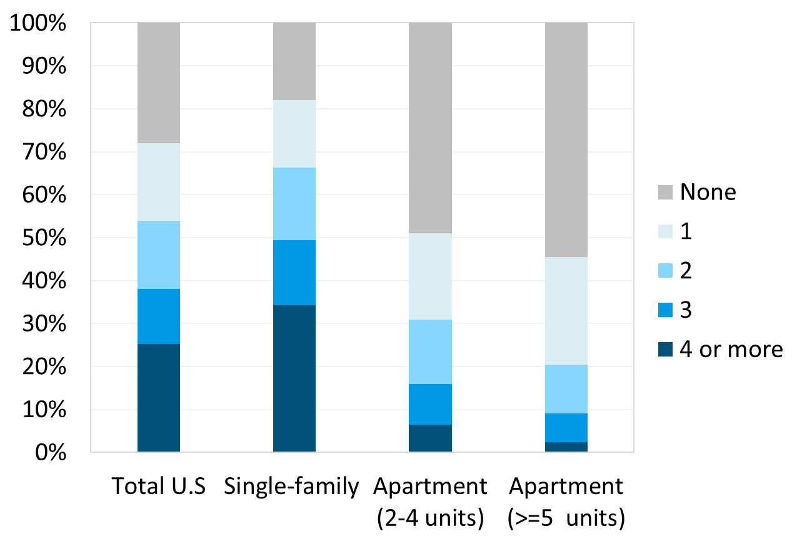

# Benefits of elevated air speed devices

Ceiling fans are more than just a basic amenity for residential applications. Increasingly, ceiling fans are found in applications varying from industrial and warehouse applications to offices and high-end hospitality settings, and everything in between.

The extensive use of ceiling fans in residential applications (over 80% of single-family homes in the United States have at least one ceiling fan), as demonstrated in the Figure below, indicates their effectiveness in supporting thermal comfort, and occupant demand for controllable air movement \[1].

<figure><figcaption>
Number of fans per household by housing unit type, data source: U.S. Energy Information Administration 2015 Residential Energy Consumption Survey
</figcaption></figure>

This widespread applicability stems from the many benefits that ceiling fans can provide in interior environments.

The key benefits of ceiling fans are as follows:

* Thermal Comfort
* Improved Air Distribution
* Improved Perceived Air Quality
* HVAC First Cost Savings
* Energy Savings

The following subsections describe each of these benefits in more detail.

\[1] Tartarini 2020
